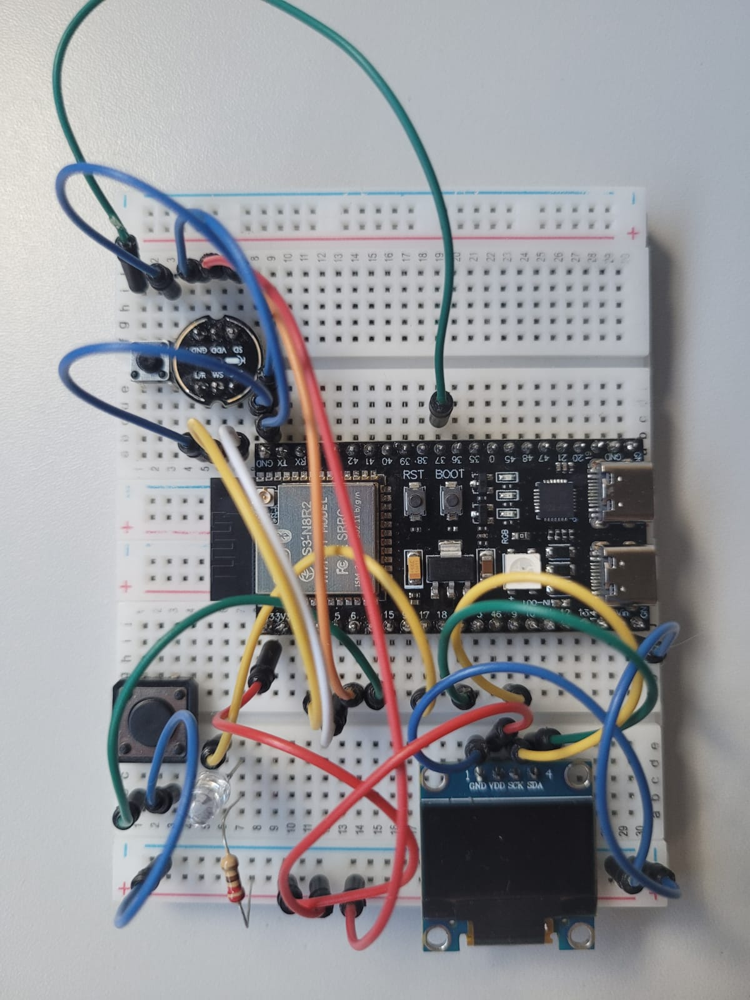
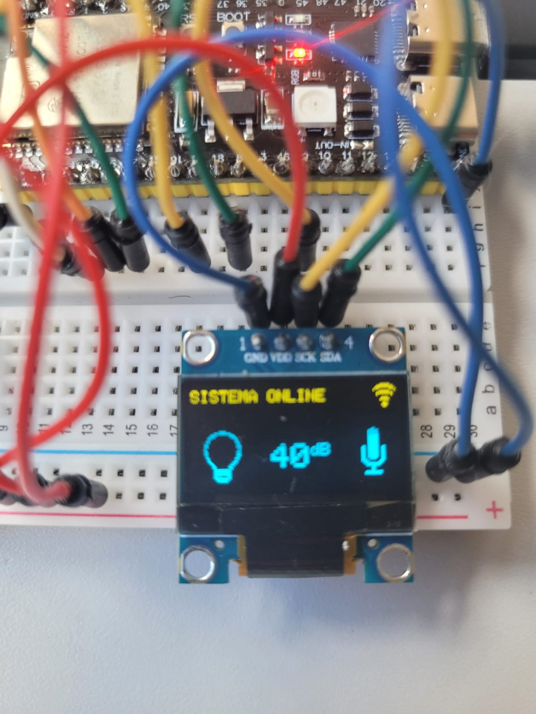

# IoT-E2PTT
Trabalho da matéria Plataformas de prototipação para IoT

# Materiais utilizados:

- ESP32 S3
- Protoboard
- Cabos
- Display OLED 2 cores (SSD1306)
- Microfone omnidirecional (INMP441)
- Led vermelho
- 2 Push button
- Resistor 220 Ohms

 
 

# Sistema Operacional e Softwares Utilizados

 - Servidor Linux 24.04 hospedado no GCP (Google Cloud Platform).
 - Banco de Dados MySQL (instruções da instalação, configuração e scripts SQL no arquivo [MySQL.md](MySQL.md))
 - Mosquitto - MQTT (instruções de instalação e configuração no arquivo  [Mosquitto.md](Mosquitto.md))
 - NodeRED (instruções de instalação e configuração no arquivo [nodeRED.md](nodeRED.md).
            Criação de fluxos via nodeRED, para comunicação via MQTT e salvar os dados em MySQL. Fluxos no arquivo [fluxos.json](fluxos.json)).
 - ArduinoIDE para codificar o ESP32 (bibliotecas  instaladas no ArduinoIDE: PubSubClient, WiFiManager, Adafruit SSD1306) 

# Como o projeto funciona

A ideia desse projeto é que o sistema vai se conectar com WiFi (utilizando biblioteca wifimanager para não deixar senhas de wifi salvas no código).
Ao ligar o dispositivo, ele inicia em modo Access Point, efetua a conexão na rede que ele gera (Config_Decibelimetro_S3) e ai, seleciona uma rede
e insere a senha dessa rede. Abrir o endereço 192.168.4.1 no navegador do celular para configurar a rede.

Após conectado ao Wifi, o sistema inicializa o visor com as informações de Wifi ligado/desligado, led ligado/desligado e microfone ligado/desligado.

Ao apertar um botão ao lado da Luz, ele acende o LED e envia via MQTT a informação que a luz está acesa. O dashboard vai ficar com a luz acesa, e 
se clicar no botão do dashboard, ele apaga a luz do dispositivo.

Ao apertar um botão ao lado do microfone, ele começa a "escutar" e enviar a medição via MQTT a cada 1 segundo, além de enviar a informação que o Microfone está ligado. 
O dashboard irá ficar com o microfone ligado, e se clicar no botão do dashboard, ele desligar o microfone no dispositivo.

Ambos os botões podem ser ligados remotamente, ou diretamente no dispositivo.

Na parte de codificação em ArduinoIDE, separei o código em vários arquivos, para melhor compreensão:
 - display.h (codificação do display OLED)
 - imagens.h (codificação das imagens que aparecem no visor)
 - mic_sensor.h (codificação do sensor de microfone)
 - communication.h (codificação Wifi, MQTT e WiFiManager)
 - common.h (codificação do temporizador)
 - IoT.ino (código principal do projeto)

# Acesso ao dashboard

   http://iotifspcat.ddns.net:1880/dashboard
   
